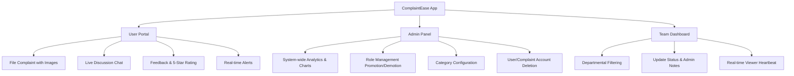
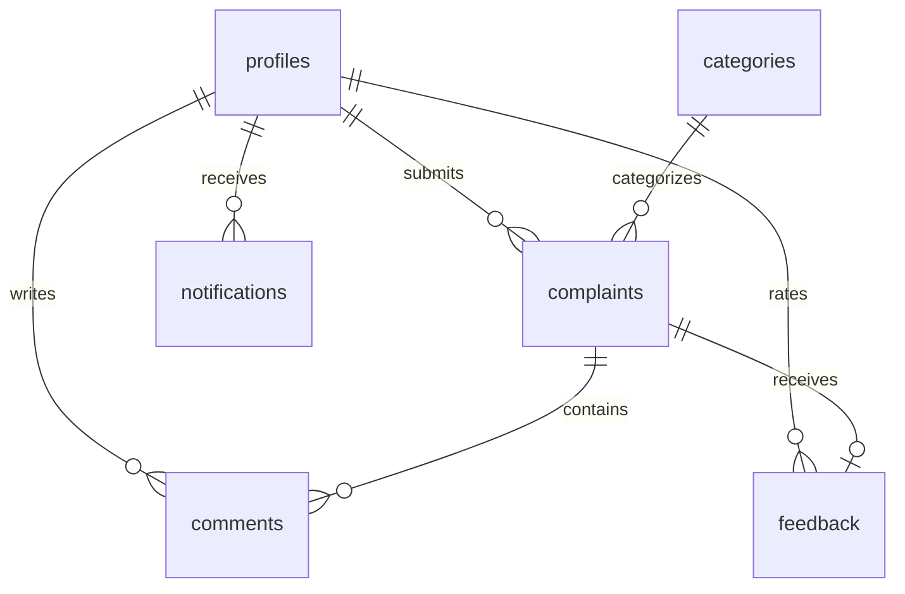
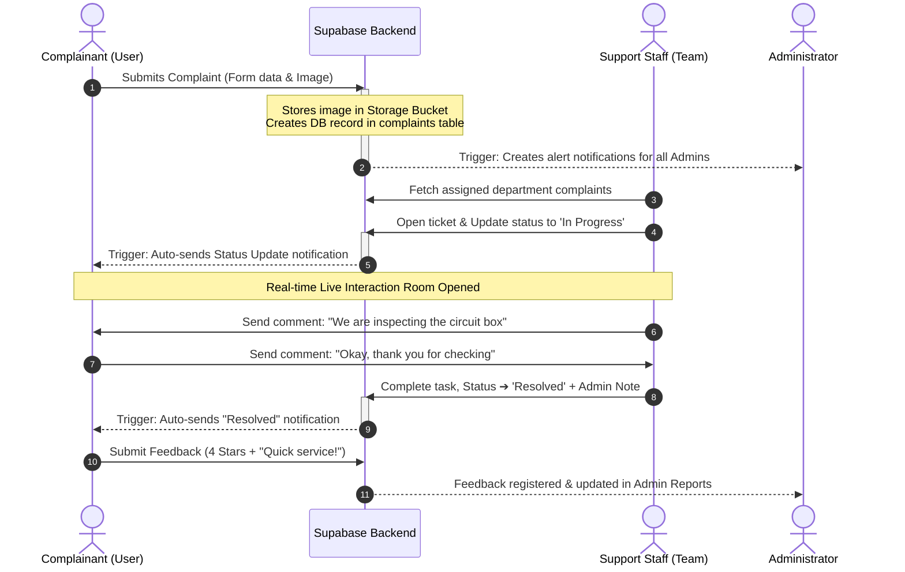

# 📋 Project Report: ComplaintEase - Smart Complaint Management System

---

## 📖 1. Executive Summary & Introduction
**ComplaintEase** is an enterprise-grade, cross-platform mobile and web application designed to bridge the communication gap between citizens/employees (Users) and organizational administrations. The system streamlines the workflow of registering, assigning, tracking, and resolving service and maintenance complaints.

Built using **Flutter** for a premium, cross-platform user experience, and **Supabase (PostgreSQL)** for a secure, highly scalable, and real-time backend, ComplaintEase provides a reliable alternative to traditional paper-based or manual complaint handling.

### 🔴 Problem Statement
Traditional systems suffer from:
*   Lack of transparency and tracking.
*   Delayed communication between support staff and complainants.
*   Absence of organized feedback loops and analytical insights.
*   Insecure data management and unauthorized viewing of complaints.

### 🟢 Proposed Solution
ComplaintEase addresses these challenges by introducing:
*   **Role-Based Access Control (RBAC):** Separate interfaces and functionalities tailored for **Users**, **Admins**, and **Team Members**.
*   **Real-time Collaboration:** Live comment streams and active viewer indicators using WebSockets/Supabase Realtime.
*   **Transparent Lifecycle:** Instant status updates accompanied by admin notes and automatic in-app alerts.
*   **Data-Driven Analytics:** Graphical representations of resolutions, categories, and ratings to aid management in decision-making.

---

## ✨ 2. Comprehensive System Features

The features of ComplaintEase are logically segmented into three dynamic dashboards:



### 👤 2.1 Complainant (User) Features
1.  **Secure Authentication:** Secure sign-up, email-based password reset, and encrypted persistence.
2.  **Public Hero & Stats Page:** A sleek, public-facing landing page showing general resolved statistics and a scrolling feed of recent resolved public complaints.
3.  **Complaint Filing Wizard:** Fully descriptive forms featuring text inputs, department/category selection, and integrated image picking from the gallery or camera (using `image_picker`).
4.  **Complaint Tracking History:** A clean view showing the list of submitted complaints, labeled with beautiful color-coded badges for status: `Pending` (Orange), `In Progress` (Blue), and `Resolved` (Green).
5.  **Interactive Live Comment Stream:** Dynamic discussion window where the user can chat directly with the assigned team member or admin, getting live updates without reloading.
6.  **Resolution Feedback Loop:** Once a complaint's status is changed to `Resolved`, the user gets the ability to rate the resolution (1 to 5 Stars) and write a custom text review.
7.  **In-App Alerts Center:** A notification tab containing read/unread status updates for all complaints filed.

### 👮 2.2 System Administrator Features
1.  **Analytics & Graphical Metrics:** Incorporates advanced graphs and pie charts (using `fl_chart`) visualizing:
    *   Total Complaints vs Resolved Complaints.
    *   Category-wise distributions.
    *   Average satisfaction ratings.
2.  **Role & Access Level Manager:** A detailed panel listing all registered profiles. Admins can promote/demote accounts to roles like `user`, `team` (staff), or `admin`, assign departments, and directly delete accounts from the server database (using RPC bypass triggers).
3.  **Category Manager:** Dynamic addition and deletion of categories (e.g., IT support, Plumbing, Security, Cleaning) that instantly update the dropdown items for users.
4.  **Global Complaint Overlord:** View and manage complaints filed across the entire organization. Admins have overriding power to assign, delete, or comment on any entry.
5.  **Feedback Quality Control:** A dedicated panel displaying all submitted user feedback and ratings, helping admins evaluate the performance of staff members.

### 🛠️ 2.3 Assigned Staff (Team Member) Features
1.  **Department-assigned Workspace:** Team members are greeted by a custom workspace showing only complaints belonging to their specific department (e.g., an IT Staff member only sees "IT Support" issues).
2.  **Status Workflow Engine:** Tools to quickly transition a complaint from `Pending` ➔ `In Progress` ➔ `Resolved`, along with entering descriptive internal progress notes.
3.  **Real-time Viewer Heartbeat:** Utilizes a presence detection query that lists which users are currently viewing the complaint ticket in real-time, preventing concurrent modifications or double handling.

---

## 🗄️ 3. Database Architecture & Schema Specification

The database is built on **PostgreSQL** hosted by **Supabase**. It utilizes custom triggers, relational constraints, foreign keys, and Row Level Security (RLS) policies to protect integrity and privacy.

### 📊 3.1 Entity-Relationship (ER) Mapping



---

### 📋 3.2 Data Dictionary (Tables Structure)

#### 1. Table: `profiles`
Stores system-wide authentication profile extensions. It links directly to Supabase's secure `auth.users` table.

| Column Name | Data Type | Constraints | Description |
|---|---|---|---|
| `id` | `UUID` | `PRIMARY KEY`, `REFERENCES auth.users` | Unique system ID mapped to Auth |
| `name` | `TEXT` | `NOT NULL` | Full Name of the user |
| `email` | `TEXT` | `NOT NULL` | Registered Email Address |
| `role` | `TEXT` | `CHECK (role IN ('user', 'admin', 'team'))`, `DEFAULT 'user'` | Assigned Role (RBAC access indicator) |
| `department`| `TEXT` | `NULLABLE` | Assigned Department (for Staff/Team) |
| `last_seen_at`| `TIMESTAMP` | `NULLABLE` | Timestamp used for Real-time presence heartbeat |
| `viewing_complaint_id`| `BIGINT` | `REFERENCES complaints(id)`, `NULLABLE` | Reference of active ticket user is viewing |
| `created_at`| `TIMESTAMP` | `DEFAULT NOW()` | Date of account creation |

#### 2. Table: `complaints`
Holds all metadata, details, status flags, and attachments for every filed complaint.

| Column Name | Data Type | Constraints | Description |
|---|---|---|---|
| `id` | `BIGINT` | `PRIMARY KEY`, `IDENTITY` | Unique ID of the complaint |
| `user_id` | `UUID` | `REFERENCES profiles(id) ON DELETE CASCADE` | Complainant who created the ticket |
| `category` | `TEXT` | `NOT NULL` | Category name (Electricity, IT, etc.) |
| `title` | `TEXT` | `NOT NULL` | Short title of the issue |
| `description` | `TEXT` | `NOT NULL` | Comprehensive details of the complaint |
| `image_url` | `TEXT` | `NULLABLE` | Public link to the uploaded image in bucket |
| `status` | `TEXT` | `CHECK (status IN ('Pending', 'In Progress', 'Resolved'))`, `DEFAULT 'Pending'` | Workflow stage indicator |
| `admin_note` | `TEXT` | `NULLABLE` | Progress/resolution notes added by team/admin |
| `created_at`| `TIMESTAMP` | `DEFAULT NOW()` | Date and time submitted |
| `updated_at`| `TIMESTAMP` | `DEFAULT NOW()` | Date and time of last edit/status update |

#### 3. Table: `categories`
Maintains the dynamic lookup lists of departments or complaint classifications.

| Column Name | Data Type | Constraints | Description |
|---|---|---|---|
| `id` | `BIGINT` | `PRIMARY KEY`, `IDENTITY` | Category identifier |
| `name` | `TEXT` | `NOT NULL`, `UNIQUE` | Unique title of the department/category |

#### 4. Table: `comments`
Stores discussion entries under individual complaints for user-staff communication.

| Column Name | Data Type | Constraints | Description |
|---|---|---|---|
| `id` | `BIGINT` | `PRIMARY KEY`, `IDENTITY` | Unique comment ID |
| `complaint_id` | `BIGINT`| `REFERENCES complaints(id) ON DELETE CASCADE` | Target complaint room |
| `user_id` | `UUID` | `REFERENCES profiles(id) ON DELETE CASCADE` | Creator of the message |
| `user_name` | `TEXT` | `NOT NULL` | Sender's screen name for quick fetch |
| `content` | `TEXT` | `NOT NULL` | Message body |
| `created_at`| `TIMESTAMP` | `DEFAULT NOW()` | Date and time sent |

#### 5. Table: `feedback`
Collects 5-star evaluation ratings and descriptive reviews from clients on resolved tasks.

| Column Name | Data Type | Constraints | Description |
|---|---|---|---|
| `id` | `BIGINT` | `PRIMARY KEY`, `IDENTITY` | Feedback ID |
| `complaint_id` | `BIGINT`| `REFERENCES complaints(id) ON DELETE CASCADE`, `UNIQUE` | One feedback per resolved ticket limit |
| `user_id` | `UUID` | `REFERENCES profiles(id) ON DELETE CASCADE` | Complainant submitting feedback |
| `rating` | `INTEGER` | `CHECK (rating >= 1 AND rating <= 5)` | Star rating |
| `review` | `TEXT` | `NULLABLE` | Detailed comments/feedback |
| `created_at`| `TIMESTAMP` | `DEFAULT NOW()` | Date of submission |

#### 6. Table: `notifications`
Saves targeted read/unread dashboard notification items.

| Column Name | Data Type | Constraints | Description |
|---|---|---|---|
| `id` | `BIGINT` | `PRIMARY KEY`, `IDENTITY` | Notification ID |
| `user_id` | `UUID` | `REFERENCES profiles(id) ON DELETE CASCADE` | Target recipient |
| `title` | `TEXT` | `NOT NULL` | Alert title |
| `message` | `TEXT` | `NOT NULL` | Alert description |
| `is_read` | `BOOLEAN` | `DEFAULT false` | Read status toggle |
| `created_at`| `TIMESTAMP` | `DEFAULT NOW()` | Date generated |

---

### 🛡️ 3.3 Security Configuration & Row Level Security (RLS)
Security is implemented inside the database engine itself via PostgreSQL RLS Policies. This ensures even if someone bypasses the client app, they cannot compromise data.

*   **`profiles` Policies:**
    *   Everyone can read profiles (needed for showing names next to comments).
    *   Users can only modify their own profile data (`auth.uid() = id`).
    *   Admins can update any profile (required for promoting users/assigning staff roles).
*   **`complaints` Policies:**
    *   Complainants can read their own tickets (`auth.uid() = user_id`).
    *   Admin and Team members can read any complaint.
    *   Public unauthenticated visitors can only view resolved complaints (`status = 'Resolved'`) with restricted details for the landing hero page feed.
    *   Complainants can create tickets.
    *   Admins and assigned department staff can update tickets. Only admins can delete complaints.
*   **`comments` & `feedback` Policies:**
    *   Users and staff can read comments on complaints they are associated with.
    *   Users can only submit feedback if they own the ticket and the status is set to `'Resolved'`.

---

### ⚡ 3.4 Database Triggers, Functions & Realtime Services
To automate operations, custom PL/pgSQL database scripts are integrated:

#### 1. Automatic Profile Initialization
Triggers instantly when a user registers on the platform via Supabase Auth, mapping their email, custom metadata (name and department) straight into our public profiles table.
```sql
CREATE OR REPLACE FUNCTION public.handle_new_user()
RETURNS TRIGGER AS $$
BEGIN
  INSERT INTO public.profiles (id, name, email, role, department)
  VALUES (
    new.id, 
    new.raw_user_meta_data->>'name', 
    new.email, 
    'user',
    new.raw_user_meta_data->>'department'
  );
  RETURN NEW;
END;
$$ LANGUAGE plpgsql SECURITY DEFINER;
```

#### 2. Automatic Admin Notification Trigger
When any user submits a new complaint, a background database trigger automatically creates and inserts notification entries for all Admins.
```sql
CREATE OR REPLACE FUNCTION public.notify_admins_on_complaint()
RETURNS TRIGGER AS $$
BEGIN
  INSERT INTO public.notifications (user_id, title, message)
  SELECT id, 'New Complaint Filed', 'A new complaint "' || NEW.title || '" has been filed.'
  FROM public.profiles
  WHERE role = 'admin';
  RETURN NEW;
END;
$$ LANGUAGE plpgsql SECURITY DEFINER;
```

#### 3. Admin User Deletion Bypass (RPC Bypass)
Auth security forbids raw clients from deleting other users directly. ComplaintEase uses a secure RPC database function with `SECURITY DEFINER` (root privilege) allowing confirmed admins to wipe accounts:
```sql
CREATE OR REPLACE FUNCTION delete_user_by_admin(target_user_id uuid)
RETURNS void AS $$
BEGIN
  IF EXISTS (
    SELECT 1 FROM public.profiles WHERE id = auth.uid() AND role = 'admin'
  ) THEN
    DELETE FROM auth.users WHERE id = target_user_id;
  ELSE
    RAISE EXCEPTION 'Only admins can delete users';
  END IF;
END;
$$ LANGUAGE plpgsql SECURITY DEFINER;
```

---

## ⚙️ 4. System Workflow & Process Mechanics

This section details how ComplaintEase executes tasks step-by-step from different perspectives.

### 🔄 4.1 Complete Lifecycle Workflow of a Complaint



---

### 🚀 4.2 Step-by-Step Functional Explanations

#### 1. Authentication & Auto-Login Flow
*   **Startup:** The `SplashScreen` runs, querying the current active session state of `Supabase.instance.client.auth.currentUser`.
*   **Redirect Paths:**
    *   If no session: Redirects to `LoginPage`.
    *   If session exists: Fetches the matching profile via `SupabaseService.getUserProfile(id)`.
    *   **Role Routing:** Redirects to `UserHomePage` if role is `user`, `AdminDashboard` if `admin`, and `TeamDashboard` if `team`.

#### 2. Image Upload & File Storage Mechanics
*   When creating a complaint, the user selects an image using the `image_picker` package.
*   The application creates a unique file path using standard timestamps: `complaint_images/${DateTime.now().millisecondsSinceEpoch}.jpg`.
*   The file is sent via raw binary upload to the `complaints` Storage Bucket:
    `client.storage.from('complaints').upload(path, file)`.
*   Once uploaded, the public link is acquired via `getPublicUrl(path)` and saved directly in the SQL database under the `image_url` column.

#### 3. Real-time Discussion/Chat Implementation
*   Comments do not poll the database. Instead, they leverage the Supabase PostgreSQL Realtime engine.
*   The chat room executes a query stream listener:
    ```dart
    client.from('comments').stream(primaryKey: ['id']).eq('complaint_id', complaintId)
    ```
*   When a message is typed and entered, it creates a simple SQL INSERT. The Database captures the change and immediately broadcasts it to all listeners in under 100ms.

#### 4. The Presence Heartbeat System (Online Indicators)
*   To prevent staff or users from double editing tickets or talking to empty screens, ComplaintEase checks viewer status.
*   **Entry:** When a user opens a complaint detail page, the app updates the backend database using:
    `updateUserPresence(complaintId)`.
*   **Active Monitor:** The app runs a repeating timer (every 10-15 seconds) which queries the profiles table:
    *   It checks for profiles where `viewing_complaint_id` matches the current ID, AND the profile's `last_seen_at` timestamp is newer than 15 seconds ago.
    *   Matches are instantly displayed in a top bar badge showing name initials and roles as "Online" (e.g. `[A] John (Admin) is online`).
*   **Exit:** On disposing the detail screen, the database column is set back to `null`.

---

## 🎨 5. Design Guidelines & Visual Architecture
ComplaintEase is crafted around modern Material Design 3 guidelines:

*   **Color Theme:**
    *   Primary Color: Dark rich Navy Blue (`0xFF1E3A8A`) for professional credibility.
    *   Accent: Vibrant Slate Teal (`0xFF0D9488`).
    *   Warning Indicators: Amber/Orange (`0xFFD97706`).
    *   Success indicators: Forest Teal Green (`0xFF059669`).
*   **Typography:** The application links the **Google Fonts - Outfit** typography package, offering premium UI layouts with sleek, geometric text weights for headers and indicators.
*   **Layout Adaptability:** Designed with flexible box models and media queries, the UI handles different screen widths, scaling smoothly on Android phones, iPhones, and desktop monitors.

---

**Document prepared for final year project presentation and software engineering documentation.**
